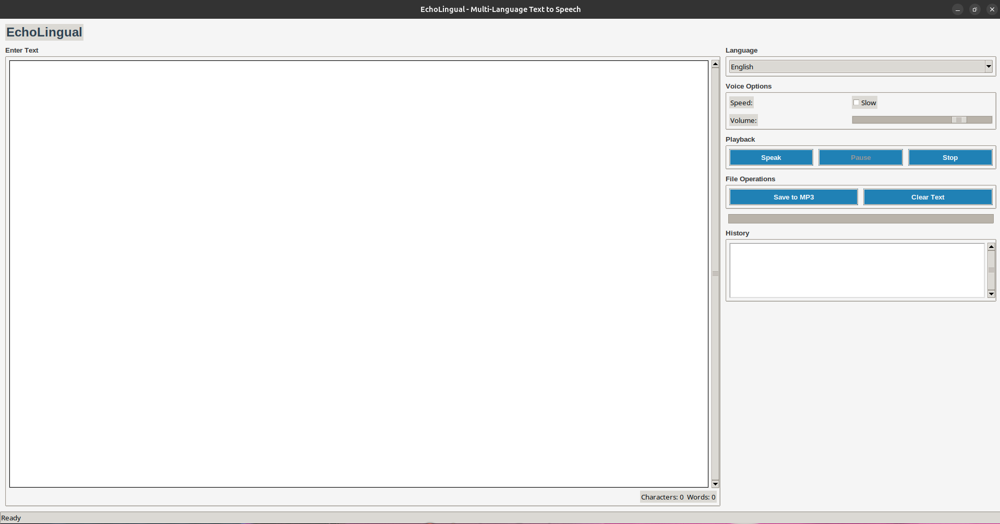

# EchoLingual: Multi-Language Text-to-Speech Application

EchoLingual is a feature-rich text-to-speech application that supports multiple languages. It provides an intuitive graphical user interface for converting text to speech with various customization options.



## Features

- **Multi-language Support**: Convert text to speech in 12 different languages, including English, Spanish, French, German, Chinese, and more
- **Adjustable Speed**: Option to play speech at normal or slow speed
- **Volume Control**: Adjust the playback volume to your preference
- **Playback Controls**: Play, pause, resume, and stop speech at any time
- **Text History**: Automatically saves your recently used texts for easy access
- **Export to MP3**: Save the generated speech as an MP3 file for later use
- **Progress Tracking**: Visual progress bar shows the current position in the audio playback
- **Word and Character Count**: Automatically counts words and characters as you type
- **Cross-Platform**: Works on Windows, macOS, and Linux systems

## Installation

### Prerequisites
- Python 3.6 or higher

### Installation Steps

1. Clone this repository:
   ```
   git clone https://github.com/yourusername/EchoLingual.git
   cd EchoLingual
   ```

2. Install the required dependencies:
   ```
   pip install -r requirements.txt
   ```

3. Run the application:
   ```
   python speech.py
   ```

## Usage Guide

### Basic Usage
1. Type or paste text into the text input area
2. Select your desired language from the dropdown menu
3. Click the "Speak" button to hear the text

### Advanced Features
- **Adjust Speed**: Check the "Slow" box for slower speech (helpful for language learning)
- **Control Volume**: Use the volume slider to adjust playback volume
- **Save Audio**: Click "Save to MP3" to export the speech as an audio file
- **History**: Double-click on any item in the history list to reload it
- **Playback Control**: Use the Pause/Resume and Stop buttons to control playback

## Supported Languages

- English
- Spanish
- French
- German
- Italian
- Portuguese
- Russian
- Japanese
- Korean
- Chinese
- Arabic
- Hindi

## Dependencies

- [gTTS](https://github.com/pndurette/gTTS) (Google Text-to-Speech): For converting text to speech
- [Pygame](https://www.pygame.org/): For audio playback
- [Pillow](https://python-pillow.org/): For image processing
- [Tkinter](https://docs.python.org/3/library/tkinter.html): For the graphical user interface

## Troubleshooting

If you encounter any issues:

1. Ensure all dependencies are correctly installed
2. Check your internet connection (gTTS requires internet access)
3. Make sure your system's audio output is configured correctly
4. If the application doesn't start, check that Python and all required packages are installed

## Contributing

Contributions are welcome! Please feel free to submit a Pull Request.

1. Fork the repository
2. Create your feature branch (`git checkout -b feature/amazing-feature`)
3. Commit your changes (`git commit -m 'Add some amazing feature'`)
4. Push to the branch (`git push origin feature/amazing-feature`)
5. Open a Pull Request

## License

This project is licensed under the MIT License - see the LICENSE file for details.

## Acknowledgements

- [Google Text-to-Speech](https://cloud.google.com/text-to-speech) for providing the speech synthesis API
- All the open-source libraries that made this project possible

---

Created with ❤️ by Zarar
